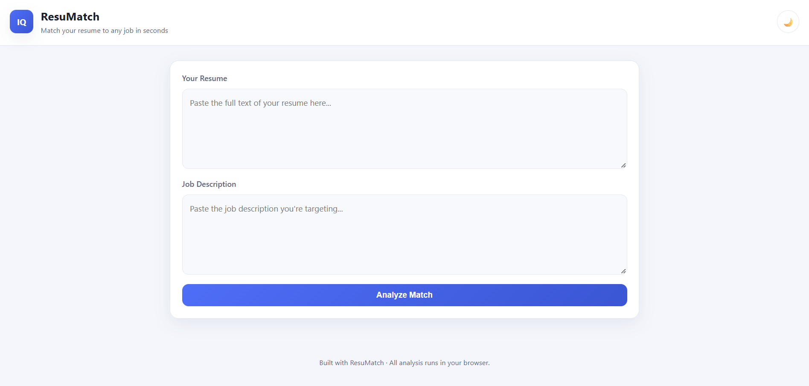

# ResuMatch

An ATS resume scorer that matches your resume against a job description, highlighting matched and missing keywords.

## Live Demo
Not deployed yet

## Screenshot


## Built With
- HTML5
- CSS3 (custom properties, dark/light theme toggle)
- Vanilla JavaScript
- Google Gemini API (optional AI-powered suggestions)

## Features
- Paste your resume and a job description to get an instant match score (0-100)
- Keyword matching across technical skills, soft skills, action verbs, and quantifiable metrics
- Resume section completeness checklist (Contact, Skills, Experience, Education, Projects, Certifications)
- Local, rule-based improvement suggestions
- Optional AI-powered suggestions via your own Gemini API key (stored locally, never committed)
- Dark/light theme toggle with saved preference

## Getting Started

### Prerequisites
- A web browser (no dependencies needed)
- Optional: a free Gemini API key from Google AI Studio, for the AI suggestions feature

### Installation
```bash
git clone https://github.com/harshilbhojwani/resumatch.git
cd resumatch
```
Then open `index.html` in your browser.

## What I Learned
Built as Sprint 3 of the GeeksforGeeks MERN course. This project taught me how to work with JavaScript functions and data structures for keyword matching logic, and how to safely integrate a third-party AI API (Gemini) using a client-provided key rather than hardcoding secrets.

## Notes
Built as part of Sprint 3 (JavaScript Functions & Data Structures) of the GeeksforGeeks MERN Full Stack course.